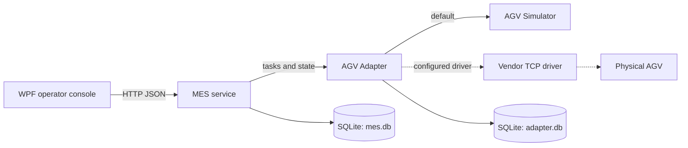

<div align="center">

# AGV MES MVP

A lightweight AGV task-control system for laboratory automation, built with `.NET 8 + WPF`.

<p>
  <a href="README.md">简体中文</a> ·
  <a href="README.ja.md">日本語</a> ·
  <a href="README.ko.md">한국어</a>
</p>


</div>

> [!IMPORTANT]
> This release is Simulator-first and intended for offline verification. Physical AGV acceptance remains `NO-GO`: do not connect, take control, or dispatch to a real vehicle until site isolation, explicit authorization, and read-only preflight evidence are available.

## Overview

AGV MES MVP orchestrates and tracks material-transfer tasks between laboratory stations. MES owns task state and audit events; Adapter isolates device protocols and idempotent dispatch; Simulator provides a repeatable development and acceptance environment.

The MVP supports a configurable station catalog, multi-AGV assignment, shortest-path planning, recovery, CSV/XLSX batch import, KPI dashboards, workflow lifecycle management, and a WPF operator console. A production device integration replaces only the Adapter driver; it does not change the MES lifecycle or API contract.

| Area | Included capability |
| --- | --- |
| Task flow | Explicit create/dispatch, operator pickup/dropoff confirmation, pause/resume/cancel, retry |
| Reliability | `task_id` idempotency, timeout reconciliation, `Unknown` recovery, MES/Adapter restart recovery |
| Scheduling | Fleet state, shortest paths, active-edge conflict filtering, fail-closed exhaustion handling |
| Operations | WPF dashboard, audit timeline, AGV communications, batch import, KPI views |
| Traceability | Separate MES and Adapter SQLite stores, task and workflow lifecycle audit |

## Architecture



- **MES** is the single write boundary for the task state machine, business actions, persistence, audit, and recovery decisions.
- **Adapter** owns station mapping, control ownership, safety gates, idempotent device operations, status queries, and timeout reconciliation.
- **Simulator** provides in-memory fleet behavior and controlled fault injection for development and offline acceptance only.
- **WPF** supplies the operator dashboard and workflow editor through MES APIs.

## Quick Start

### Prerequisites

- Windows 10/11
- .NET 8 SDK
- An interactive Windows desktop session for WPF UI verification

### Build and test

```powershell
dotnet restore MesControlAgv.sln
dotnet build MesControlAgv.sln --no-restore
dotnet test MesControlAgv.sln --no-build
```

If shared compilation is unreliable on the host, build and test serially:

```powershell
dotnet build MesControlAgv.sln --no-restore -p:UseSharedCompilation=false -m:1
dotnet test MesControlAgv.sln --no-build -p:UseSharedCompilation=false -m:1
```

The latest Release baseline (2026-08-07) completed with 0 warnings, 0 errors, and `210/210` automated tests passing.

### Run locally

Services start in `Simulator -> Adapter -> MES` order.

| Service | URL | Responsibility |
| --- | --- | --- |
| Simulator | `http://localhost:5183` | Virtual fleet and development fault controls |
| Adapter | `http://localhost:5041` | Device protocol, scheduling, idempotency boundary |
| MES | `http://localhost:5045` | Tasks, audit, and business API |

```powershell
.\scripts\run-local.ps1
.\scripts\verify-local.ps1
```

Run the desktop client separately, then close it before stopping services:

```powershell
$env:MES_BASE_URL = 'http://localhost:5045/'
$env:WPF_RUNTIME_MODE = 'simulator'
dotnet run --project src/MesControlAgv.Wpf

.\scripts\stop-local.ps1
```

## Isolated Process Verification

Use unique ports, temporary SQLite files, and a run ID for process-level verification. The scripts persist process IDs, ports, DLL paths, and database paths; they wait for matching `/health` responses and validate executable identity and port ownership before a stop or restart.

```powershell
$runId = 'offline-20260807-a'
$runRoot = Join-Path ([IO.Path]::GetTempPath()) "MesControlAgv-$runId"
New-Item -ItemType Directory -Path $runRoot -Force | Out-Null

.\scripts\run-local.ps1 `
  -Configuration Release `
  -RunId $runId `
  -SimulatorUrl http://localhost:5361 `
  -AdapterUrl http://localhost:5362 `
  -MesUrl http://localhost:5363 `
  -MesDatabasePath (Join-Path $runRoot 'mes.db') `
  -AdapterDatabasePath (Join-Path $runRoot 'adapter.db') `
  -RequireIsolatedStores

.\scripts\verify-local.ps1 -RunId $runId -RequireIsolatedStores -SourceStationCode 2 -TargetStationCode 4
.\scripts\stop-local.ps1 -RunId $runId
```

Do not reuse development databases or use a physical-acceptance profile for process verification. See [Local Simulator verification](docs/LOCAL-VERIFICATION.md).

## Verification Matrix

| Scenario | Verifies |
| --- | --- |
| Default positive flow | Create, dispatch, arrival, operator confirmation, completion, and audit |
| `failure-retry` | Simulator navigation failure, `DeviceFailed` audit, retry of the original task |
| `timeout-recover` | `Unknown`, device-operation recreation, `ReconciledMoving`, then completion |
| `cancel` | Created and active-task cancellation with fleet cleanup |
| `multi-agv` | Three independent assignments and fail-closed fourth-task exhaustion |
| `restart-resume` | Adapter/MES restart while Simulator keeps the persisted operation available |
| `workflow-publish-rollback` | Draft, validation, immutable publish, rollback version, and audit |

Timeouts never cause blind navigation resend. The system queries the device by task and operation ID before deciding to reconcile, retry, or mark an exception.

## Physical AGV Boundary

The Adapter includes a configurable vendor TCP driver, but Simulator is the default. Before enabling `Agv:Driver=tcp`, complete an isolated and authorized preflight for map name/version/MD5, station IDs and directed edges, robot IP and firmware, automatic mode, control ownership, localization and safety gates, then conduct a low-speed unloaded acceptance run.

## Documentation

- [Local isolated-process verification](docs/LOCAL-VERIFICATION.md)
- [Vendor TCP Adapter](docs/AGV-TCP-ADAPTER.md)
- [Physical acceptance boundary](docs/physical-acceptance/README.md)
- [Progress and handoff](docs/PROGRESS.md)
- [MVP design](docs/superpowers/specs/2026-07-29-agv-mes-mvp-design.md)
