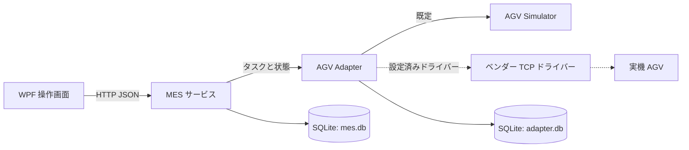

<div align="center">

# AGV MES MVP

研究室自動化向けの軽量 AGV タスク管制システムです。`.NET 8 + WPF` で構築されています。

<p>
  <a href="README.md">简体中文</a> ·
  <a href="README.en.md">English</a> ·
  <a href="README.ko.md">한국어</a>
</p>


</div>

> [!IMPORTANT]
> このリリースは Simulator を使うオフライン検証が中心です。実機 AGV の受入は `NO-GO` 状態です。現場隔離、明示的な承認、読み取り専用の事前確認がそろうまで、実機への接続、制御、タスク投入は行わないでください。

## 概要

AGV MES MVP は、研究室内の固定ステーション間で行う搬送タスクを作成、配車、追跡します。MES はタスク状態と監査イベントを管理し、Adapter は装置プロトコルと冪等な配車を分離し、Simulator は再現可能な開発・検証環境を提供します。

設定可能なステーションカタログ、複数 AGV 配車、最短経路、復旧、CSV/XLSX 一括取込、KPI、ワークフロー管理、WPF 操作画面を備えます。実機連携では Adapter 内部のドライバーだけを差し替え、MES のライフサイクルと API 契約は変更しません。

| 領域 | 主な機能 |
| --- | --- |
| タスク | 作成と明示的な派車、取貨/放貨確認、一時停止/再開/取消、再試行 |
| 信頼性 | `task_id` 冪等性、タイムアウト照合、`Unknown` 復旧、MES/Adapter 再起動復旧 |
| 配車 | フリート状態、最短経路、競合区間の除外、リソース不足時のフェイルクローズ |
| 操作 | WPF ダッシュボード、監査タイムライン、AGV 通信、一括取込、KPI |

## アーキテクチャ



- **MES**: タスク状態機械、永続化、監査、復旧判断の唯一の書込み境界です。
- **Adapter**: ステーションマッピング、制御権、安全ゲート、冪等な装置操作、状態照会を担当します。
- **Simulator**: インメモリのフリートと故障注入を提供し、開発とオフライン受入専用です。
- **WPF**: MES API 経由で操作員画面とワークフローエディターを提供します。

## クイックスタート

### 前提条件

- Windows 10/11
- .NET 8 SDK
- WPF UI 検証には対話可能な Windows デスクトップセッション

### ビルドとテスト

```powershell
dotnet restore MesControlAgv.sln
dotnet build MesControlAgv.sln --no-restore
dotnet test MesControlAgv.sln --no-build
```

共有コンパイルで問題が出る場合は、直列実行を使用します。

```powershell
dotnet build MesControlAgv.sln --no-restore -p:UseSharedCompilation=false -m:1
dotnet test MesControlAgv.sln --no-build -p:UseSharedCompilation=false -m:1
```

最新 Release 基線（2026-08-07）は、警告 0、エラー 0、テスト `210/210` 成功です。

### ローカル起動

サービスは `Simulator -> Adapter -> MES` の順に起動します。

| サービス | URL |
| --- | --- |
| Simulator | `http://localhost:5183` |
| Adapter | `http://localhost:5041` |
| MES | `http://localhost:5045` |

```powershell
.\scripts\run-local.ps1
.\scripts\verify-local.ps1
```

WPF クライアントは別の PowerShell で実行し、終了後にサービスを停止します。

```powershell
$env:MES_BASE_URL = 'http://localhost:5045/'
$env:WPF_RUNTIME_MODE = 'simulator'
dotnet run --project src/MesControlAgv.Wpf

.\scripts\stop-local.ps1
```

## 分離プロセス検証

プロセスレベルの検証では、固有のポート、テンポラリ SQLite、実行 ID を必ず使います。スクリプトは PID、ポート、DLL、DB パスを記録し、該当する `/health` を待機します。停止や再起動の前には実行ファイルの同一性とポート所有者も検証します。

```powershell
$runId = 'offline-20260807-a'
$runRoot = Join-Path ([IO.Path]::GetTempPath()) "MesControlAgv-$runId"
New-Item -ItemType Directory -Path $runRoot -Force | Out-Null

.\scripts\run-local.ps1 `
  -Configuration Release `
  -RunId $runId `
  -SimulatorUrl http://localhost:5361 `
  -AdapterUrl http://localhost:5362 `
  -MesUrl http://localhost:5363 `
  -MesDatabasePath (Join-Path $runRoot 'mes.db') `
  -AdapterDatabasePath (Join-Path $runRoot 'adapter.db') `
  -RequireIsolatedStores

.\scripts\verify-local.ps1 -RunId $runId -RequireIsolatedStores -SourceStationCode 2 -TargetStationCode 4
.\scripts\stop-local.ps1 -RunId $runId
```

開発用 DB を再利用したり、物理受入 profile を使ったりしないでください。詳細は [ローカル分離プロセス検証](docs/LOCAL-VERIFICATION.md) と [WPF UI Automation 検証](docs/WPF-UIA-VERIFICATION.md) を参照してください。

## 検証シナリオ

| シナリオ | 内容 |
| --- | --- |
| 正常フロー | 作成、派車、到着、操作員確認、完了、監査 |
| `failure-retry` | Simulator のナビゲーション失敗、`DeviceFailed`、元タスクの再試行 |
| `timeout-recover` | `Unknown`、装置操作再作成、`ReconciledMoving`、完了 |
| `cancel` | 作成済み/実行中タスクの取消とフリート解放 |
| `multi-agv` | 3 台への独立配車と 4 件目のフェイルクローズ |
| `restart-resume` | Simulator を維持した Adapter/MES 再起動復旧 |
| `workflow-publish-rollback` | 下書き、検証、不変リリース、ロールバック、監査 |

タイムアウト時にナビゲーションを盲目的に再送しません。タスク ID と操作 ID で実機状態を照会してから、照合、再試行、例外化を判断します。

## 実機 AGV の境界

Adapter には設定可能なベンダー TCP ドライバーがありますが、既定は Simulator です。`Agv:Driver=tcp` を有効にする前に、隔離・承認済み環境で地図名/バージョン/MD5、ステーション ID と有向エッジ、ロボット IP とファームウェア、自動モード、制御権、位置推定と安全ゲートを確認し、低速無積載の受入試験を行ってください。

## ドキュメント

- [ローカル分離プロセス検証](docs/LOCAL-VERIFICATION.md)
- [WPF UI Automation オフライン検証](docs/WPF-UIA-VERIFICATION.md)
- [ベンダー TCP Adapter](docs/AGV-TCP-ADAPTER.md)
- [物理受入の境界](docs/physical-acceptance/README.md)
- [進捗と引継ぎ](docs/PROGRESS.md)
- [MVP 設計](docs/superpowers/specs/2026-07-29-agv-mes-mvp-design.md)
