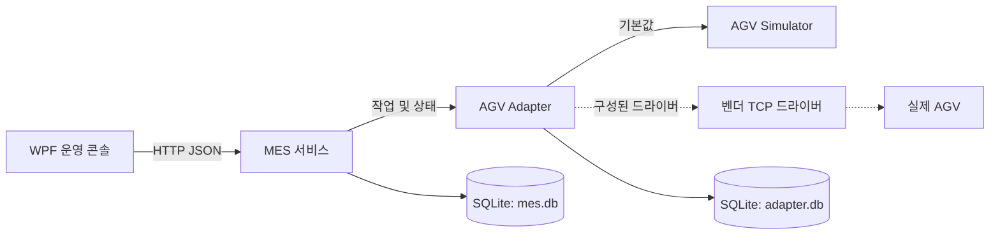

<div align="center">

# AGV MES MVP

실험실 자동화를 위한 경량 AGV 작업 제어 시스템입니다. `.NET 8 + WPF`로 구축되었습니다.

<p>
  <a href="README.md">简体中文</a> ·
  <a href="README.en.md">English</a> ·
  <a href="README.ja.md">日本語</a>
</p>


</div>

> [!IMPORTANT]
> 이 릴리스는 Simulator 기반 오프라인 검증을 우선합니다. 실제 AGV 인수는 `NO-GO` 상태입니다. 현장 격리, 명시적 승인, 읽기 전용 사전 점검 증거가 확보되기 전에는 실제 차량에 연결하거나 제어하거나 작업을 배차하지 마십시오.

## 개요

AGV MES MVP는 실험실의 고정 스테이션 간 자재 이송 작업을 생성, 배차, 추적합니다. MES는 작업 상태와 감사 이벤트를 소유하고, Adapter는 장비 프로토콜과 멱등 배차를 분리하며, Simulator는 반복 가능한 개발 및 검증 환경을 제공합니다.

설정 가능한 스테이션 카탈로그, 다중 AGV 배차, 최단 경로, 복구, CSV/XLSX 일괄 가져오기, KPI, 워크플로 수명주기 관리, WPF 운영 화면을 지원합니다. 실제 장비 연동 시에는 Adapter 내부 드라이버만 교체되며 MES 수명주기와 API 계약은 바뀌지 않습니다.

| 영역 | 제공 기능 |
| --- | --- |
| 작업 흐름 | 명시적 생성/배차, 픽업/하차 확인, 일시 정지/재개/취소, 재시도 |
| 신뢰성 | `task_id` 멱등성, 타임아웃 대사, `Unknown` 복구, MES/Adapter 재시작 복구 |
| 배차 | 플릿 상태, 최단 경로, 활성 구간 충돌 필터링, 자원 부족 시 fail-closed |
| 운영 | WPF 대시보드, 감사 타임라인, AGV 통신, 일괄 가져오기, KPI |

## 아키텍처



- **MES**: 작업 상태 기계, 영속화, 감사, 복구 판단의 유일한 쓰기 경계입니다.
- **Adapter**: 스테이션 매핑, 제어권, 안전 게이트, 멱등 장비 작업, 상태 조회를 담당합니다.
- **Simulator**: 메모리 내 플릿과 제어 가능한 장애 주입을 제공하며 개발 및 오프라인 인수 전용입니다.
- **WPF**: MES API를 통해 운영자 대시보드와 워크플로 편집기를 제공합니다.

## 빠른 시작

### 사전 요구 사항

- Windows 10/11
- .NET 8 SDK
- WPF UI 검증을 위한 대화형 Windows 데스크톱 세션

### 빌드 및 테스트

```powershell
dotnet restore MesControlAgv.sln
dotnet build MesControlAgv.sln --no-restore
dotnet test MesControlAgv.sln --no-build
```

공유 컴파일러 문제 발생 시 직렬 모드를 사용합니다.

```powershell
dotnet build MesControlAgv.sln --no-restore -p:UseSharedCompilation=false -m:1
dotnet test MesControlAgv.sln --no-build -p:UseSharedCompilation=false -m:1
```

최근 Release 기준(2026-08-07)은 경고 0건, 오류 0건, 자동화 테스트 `210/210` 통과입니다.

### 로컬 실행

서비스는 `Simulator -> Adapter -> MES` 순서로 시작합니다.

| 서비스 | URL |
| --- | --- |
| Simulator | `http://localhost:5183` |
| Adapter | `http://localhost:5041` |
| MES | `http://localhost:5045` |

```powershell
.\scripts\run-local.ps1
.\scripts\verify-local.ps1
```

WPF 클라이언트는 별도의 PowerShell에서 실행하고, 완료 후 서비스를 중지합니다.

```powershell
$env:MES_BASE_URL = 'http://localhost:5045/'
$env:WPF_RUNTIME_MODE = 'simulator'
dotnet run --project src/MesControlAgv.Wpf

.\scripts\stop-local.ps1
```

## 격리 프로세스 검증

프로세스 수준 검증에는 고유 포트, 임시 SQLite 파일, 실행 ID를 사용해야 합니다. 스크립트는 PID, 포트, DLL, 데이터베이스 경로를 기록하고 일치하는 `/health` 응답을 기다립니다. 중지 또는 재시작 전에 실행 파일 ID와 포트 소유권도 확인합니다.

```powershell
$runId = 'offline-20260807-a'
$runRoot = Join-Path ([IO.Path]::GetTempPath()) "MesControlAgv-$runId"
New-Item -ItemType Directory -Path $runRoot -Force | Out-Null

.\scripts\run-local.ps1 `
  -Configuration Release `
  -RunId $runId `
  -SimulatorUrl http://localhost:5361 `
  -AdapterUrl http://localhost:5362 `
  -MesUrl http://localhost:5363 `
  -MesDatabasePath (Join-Path $runRoot 'mes.db') `
  -AdapterDatabasePath (Join-Path $runRoot 'adapter.db') `
  -RequireIsolatedStores

.\scripts\verify-local.ps1 -RunId $runId -RequireIsolatedStores -SourceStationCode 2 -TargetStationCode 4
.\scripts\stop-local.ps1 -RunId $runId
```

개발 데이터베이스를 재사용하거나 물리 인수 profile을 사용하지 마십시오. 자세한 내용은 [로컬 격리 프로세스 검증](docs/LOCAL-VERIFICATION.md)을 참조하십시오.

## 검증 시나리오

| 시나리오 | 검증 내용 |
| --- | --- |
| 기본 정상 흐름 | 생성, 배차, 도착, 운영자 확인, 완료, 감사 |
| `failure-retry` | Simulator 탐색 실패, `DeviceFailed`, 원래 작업 재시도 |
| `timeout-recover` | `Unknown`, 장비 작업 재생성, `ReconciledMoving`, 완료 |
| `cancel` | 생성/진행 중 작업 취소 및 플릿 정리 |
| `multi-agv` | 3대 독립 배차와 4번째 작업의 fail-closed 처리 |
| `restart-resume` | Simulator를 유지한 Adapter/MES 재시작 복구 |
| `workflow-publish-rollback` | 초안, 검증, 불변 게시, 롤백, 감사 |

타임아웃에서 탐색 명령을 무조건 재전송하지 않습니다. 작업 ID와 작업 operation ID로 장비의 실제 상태를 조회한 뒤 대사, 재시도 또는 예외 처리를 결정합니다.

## 실제 AGV 경계

Adapter에는 구성 가능한 벤더 TCP 드라이버가 있지만 기본값은 Simulator입니다. `Agv:Driver=tcp`를 활성화하기 전에 격리되고 승인된 환경에서 맵 이름/버전/MD5, 스테이션 ID 및 방향 간선, 로봇 IP와 펌웨어, 자동 모드, 제어권, 위치 추정 및 안전 게이트를 확인하고 저속 무부하 인수 테스트를 완료해야 합니다.

## 문서

- [로컬 격리 프로세스 검증](docs/LOCAL-VERIFICATION.md)
- [벤더 TCP Adapter](docs/AGV-TCP-ADAPTER.md)
- [물리 인수 경계](docs/physical-acceptance/README.md)
- [진행 상황 및 인계](docs/PROGRESS.md)
- [MVP 설계](docs/superpowers/specs/2026-07-29-agv-mes-mvp-design.md)
