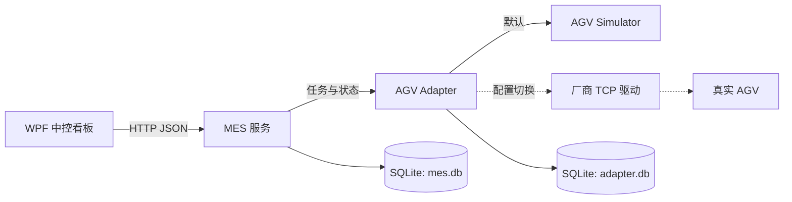

<div align="center">

# AGV MES MVP

面向实验室自动化场景的轻量级 AGV 任务中控，基于 `.NET 8 + WPF` 构建。

<p>
  <a href="README.en.md">English</a> ·
  <a href="README.ja.md">日本語</a> ·
  <a href="README.ko.md">한국어</a>
</p>


</div>

> [!IMPORTANT]
> 当前版本以 Simulator 离线验证为主。真实 AGV 仍处于物理验收 `NO-GO` 状态；在取得现场隔离、明确授权和只读预检证据前，不连接、不控制、不下发实体任务。

## 项目定位

本项目用于编排并追踪 AGV 在固定站点之间的实验室物料搬运任务。它把业务流程、设备协议和操作界面拆成清晰的边界：MES 负责任务状态与审计，Adapter 负责设备协议和幂等派单，Simulator 提供可重复的开发与验收环境。

当前 MVP 已支持多台仿真 AGV、配置驱动的站点目录、最短路径规划、任务恢复、批量导入、KPI 看板和 WPF 操作界面。真实设备接入只替换 Adapter 内部驱动，不改变 MES 生命周期和 API 合同。

## 能力概览

| 领域 | 已支持能力 |
| --- | --- |
| 任务编排 | 创建与显式派发、人工取货/放货确认、暂停/恢复/取消、失败重试 |
| 可靠性 | `task_id` 幂等、超时状态对账、`Unknown` 恢复、MES/Adapter 重启恢复 |
| 调度 | 多 AGV 车队状态、最短路径、活动路段冲突过滤、资源不足时闭环失败 |
| 操作界面 | WPF MVVM 看板、任务详情与审计时间线、AGV 通讯、批量 CSV/XLSX 导入、KPI |
| 设备边界 | Simulator 默认驱动；可配置厂商 TCP Adapter；真实模式隐藏 Simulator 控制 |
| 可追溯性 | MES SQLite 任务库、Adapter 操作库、任务和工作流生命周期审计 |

## 架构



核心职责如下：

- **MES**：任务状态机、业务动作、持久化、审计事件和恢复决策的唯一写入边界。
- **AGV Adapter**：站点映射、控制权、安全门禁、幂等派单、设备状态查询和超时对账。
- **Simulator**：内存车队、可控到站和故障注入，仅用于开发与离线验收。
- **WPF**：操作员看板和工作流编辑器，通过 MES API 执行业务动作。

## 快速开始

### 环境要求

- Windows 10/11
- .NET 8 SDK
- 交互式 WPF 验证需要可用的 Windows 桌面会话

### 构建与测试

在本 README 所在的仓库根目录执行：

```powershell
dotnet restore MesControlAgv.sln
dotnet build MesControlAgv.sln --no-restore
dotnet test MesControlAgv.sln --no-build
```

如果本机共享编译器导致构建失败，使用串行模式：

```powershell
dotnet build MesControlAgv.sln --no-restore -p:UseSharedCompilation=false -m:1
dotnet test MesControlAgv.sln --no-build -p:UseSharedCompilation=false -m:1
```

最近一次 Release 基线（2026-08-07）为 0 个警告、0 个错误，自动化测试 `210/210` 通过。

### 启动本地服务

服务按 `Simulator -> Adapter -> MES` 的顺序启动。默认本地端点为：

| 服务 | 地址 | 作用 |
| --- | --- | --- |
| Simulator | `http://localhost:5183` | 仿真车队和开发故障控制 |
| Adapter | `http://localhost:5041` | 设备协议、调度和幂等边界 |
| MES | `http://localhost:5045` | 任务、审计和业务 API |

```powershell
.\scripts\run-local.ps1
.\scripts\verify-local.ps1
```

完成 WPF 验证后，先关闭客户端，再执行：

```powershell
.\scripts\stop-local.ps1
```

WPF 客户端单独运行：

```powershell
$env:MES_BASE_URL = 'http://localhost:5045/'
$env:WPF_RUNTIME_MODE = 'simulator'
dotnet run --project src/MesControlAgv.Wpf
```

### 隔离进程验证

进程级验证必须使用独立的端口、临时 SQLite 文件和运行 ID。脚本会记录 PID、端口、DLL 和数据库路径，只等待匹配服务的 `/health` 就绪；停止或重启前还会校验可执行文件身份和端口归属。

```powershell
$runId = 'offline-20260807-a'
$runRoot = Join-Path ([IO.Path]::GetTempPath()) "MesControlAgv-$runId"
New-Item -ItemType Directory -Path $runRoot -Force | Out-Null

.\scripts\run-local.ps1 `
  -Configuration Release `
  -RunId $runId `
  -SimulatorUrl http://localhost:5361 `
  -AdapterUrl http://localhost:5362 `
  -MesUrl http://localhost:5363 `
  -MesDatabasePath (Join-Path $runRoot 'mes.db') `
  -AdapterDatabasePath (Join-Path $runRoot 'adapter.db') `
  -RequireIsolatedStores

.\scripts\verify-local.ps1 `
  -RunId $runId `
  -RequireIsolatedStores `
  -SourceStationCode 2 `
  -TargetStationCode 4

.\scripts\stop-local.ps1 -RunId $runId
```

不要在进程级验证中复用开发数据库，也不要用物理验收 profile。完整场景说明见 [本地隔离进程验证](docs/LOCAL-VERIFICATION.md)；WPF UI Automation 说明见 [WPF 离线验证](docs/WPF-UIA-VERIFICATION.md)。

## 验证场景

| 场景 | 验证内容 |
| --- | --- |
| 默认正向流程 | 创建、派发、到站、人工确认、完成和审计时间线 |
| `failure-retry` | Simulator 导航失败、`DeviceFailed` 审计、原任务重试 |
| `timeout-recover` | `Unknown`、设备操作重建、`ReconciledMoving` 后继续执行 |
| `cancel` | Created 任务取消、活动设备操作确认取消、车队归零 |
| `multi-agv` | 三台 AGV 独立分配，资源耗尽时第四个任务闭环失败 |
| `restart-resume` | 保持 Simulator 运行，重启 Adapter/MES 后恢复持久化任务 |
| `workflow-publish-rollback` | 工作流草稿、校验、发布、不可变版本和回滚审计 |

Simulator 故障控制示例：

```powershell
Invoke-RestMethod -Method Post http://localhost:5183/controls/fail
```

网络超时不会盲目重发导航。系统先以任务和操作 ID 查询设备真实状态，再决定恢复、重试或进入异常状态。

## 默认站点目录

运行时 WPF 从 `GET /api/stations` 读取启用站点和机器 ID，部署到其他现场时应更新 profile，不应修改界面代码。

| 编号 | 站点 | 机器站点 ID |
| ---: | --- | --- |
| 0 | 充电桩 | `CHARGE_01` |
| 1 | 耗材位 | `PICK_01` |
| 2 | 样品位 | `SAMPLE_01` |
| 3 | 开盖分液工作站 | `ST_OPEN_01` |
| 4 | 液体前处理工作站 | `ST_PREP_01` |
| 5 | 自动进样器 | `ST_INJECT_01` |
| 6 | 样品回收位 | `DROP_01` |

## 真实 AGV 边界

Adapter 已提供配置选择的厂商 TCP 驱动，覆盖帧格式、控制权、导航、状态查询、暂停/恢复、取消和安全门禁映射。Simulator 仍是默认驱动。

启用 `Agv:Driver=tcp` 前，必须在隔离环境完成：

1. 地图名称、版本、MD5、站点 ID 和直接有向边比对；
2. 机器人 IP、固件版本、自动模式和控制权确认；
3. 定位置信度、急停、障碍、低速限制和机构 DI/DO 只读预检；
4. 经过授权的低速、空载现场验收。

相关资料：[真实 AGV TCP Adapter](docs/AGV-TCP-ADAPTER.md)、[现场验收清单](docs/physical-acceptance/README.md)。

## 文档导航

- [本地隔离进程验证](docs/LOCAL-VERIFICATION.md)
- [WPF UI Automation 离线验证](docs/WPF-UIA-VERIFICATION.md)
- [真实 AGV TCP Adapter](docs/AGV-TCP-ADAPTER.md)
- [物理验收边界](docs/physical-acceptance/README.md)
- [项目进度与交接记录](docs/PROGRESS.md)
- [MVP 设计说明](docs/superpowers/specs/2026-07-29-agv-mes-mvp-design.md)

## 当前状态

离线 MVP 已完成主要流程和扩展验证，Simulator-first 运行路径可重复验收。下一阶段聚焦只读 readiness/路线/审计信息、已发布工作流与运输派发的衔接，以及持续维护本地进程验证矩阵。真实 AGV 接入仍由现场证据和明确授权门禁控制。
