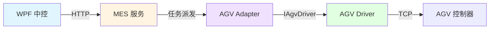
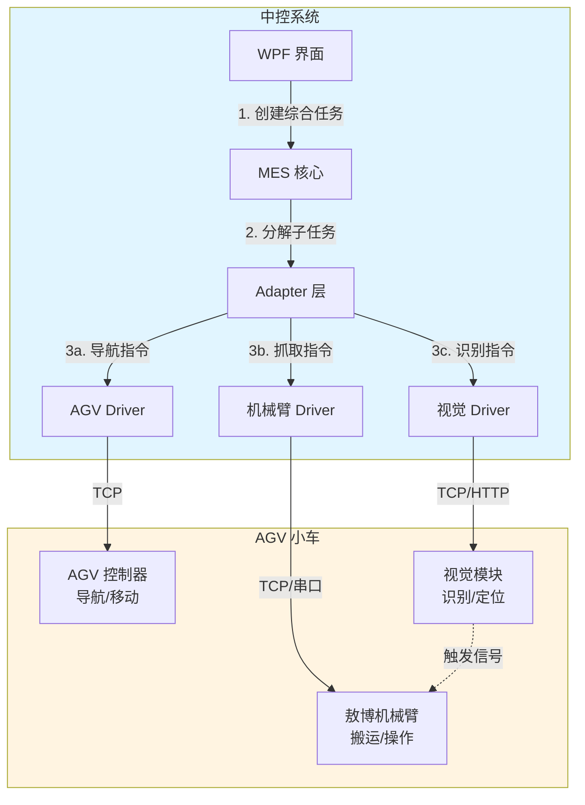

# 敖博机械臂与视觉模块集成方案

## 概述

本文档说明如何在现有 AGV MES 中控架构中集成深圳敖博机械臂和视觉模块，实现 AGV 搭载的机械臂控制、视觉识别与定位功能。

## 当前架构回顾



当前系统通过 **分层驱动模型** 实现设备对接：

- **MES 层**：任务状态机、业务逻辑、审计
- **Adapter 层**：设备协议适配、幂等派单、状态查询
- **Driver 层**：标准化设备接口 (`IAgvDriver`, `IAgvDeviceClient`)
- **Device 层**：具体设备实现（Simulator、TcpAgvClient）

## 集成架构设计

### 1. 整体架构



### 2. 设备通信层次

| 层次 | 职责 | 关键接口 |
|------|------|---------|
| **MES 任务层** | 编排综合任务（导航+抓取+视觉） | `TaskService`, `TransportTask` |
| **Adapter 协调层** | 多设备协同、状态聚合 | `IAgvDriver`, `IRobotArmDriver`, `IVisionDriver` |
| **Driver 抽象层** | 标准化设备操作接口 | 统一的 Command/Response 模型 |
| **Device 实现层** | 具体设备协议实现 | TCP/串口/HTTP 客户端 |

## 机械臂集成方案

### 3.1 定义机械臂驱动接口

参照现有 `IAgvDriver` 模式，创建机械臂标准接口：

```csharp
// src/MesControlAgv.Application/DeviceAbstractions/RobotArmDriverAbstractions.cs
namespace MesControlAgv.Application;

/// <summary>
/// 机械臂设备驱动接口
/// </summary>
public interface IRobotArmDriver
{
    string DriverId { get; }
    
    RobotArmCapabilities Capabilities { get; }
    
    /// <summary>
    /// 建立连接并初始化
    /// </summary>
    Task ConnectAsync(CancellationToken cancellationToken);
    
    /// <summary>
    /// 获取机械臂当前状态
    /// </summary>
    Task<RobotArmStatusResponse> GetStatusAsync(CancellationToken cancellationToken);
    
    /// <summary>
    /// 执行抓取操作
    /// </summary>
    Task<RobotArmOperationResponse> PickAsync(
        RobotArmPickCommand command,
        CancellationToken cancellationToken);
    
    /// <summary>
    /// 执行放置操作
    /// </summary>
    Task<RobotArmOperationResponse> PlaceAsync(
        RobotArmPlaceCommand command,
        CancellationToken cancellationToken);
    
    /// <summary>
    /// 移动到指定位置（不抓取）
    /// </summary>
    Task<RobotArmOperationResponse> MoveToAsync(
        RobotArmMoveCommand command,
        CancellationToken cancellationToken);
    
    /// <summary>
    /// 回到安全位置（Home）
    /// </summary>
    Task<RobotArmOperationResponse> HomeAsync(CancellationToken cancellationToken);
    
    /// <summary>
    /// 急停
    /// </summary>
    Task EmergencyStopAsync(CancellationToken cancellationToken);
}

/// <summary>
/// 机械臂能力描述
/// </summary>
public sealed record RobotArmCapabilities(
    bool SupportsForceControl,      // 支持力控
    bool SupportsVisionGuidance,    // 支持视觉引导
    bool SupportsDragTeaching,      // 支持拖动示教
    int MaxPayloadGrams,            // 最大负载（克）
    int ReachMillimeters);          // 工作半径（毫米）

/// <summary>
/// 机械臂状态响应
/// </summary>
public sealed record RobotArmStatusResponse(
    string State,                   // Idle, Moving, Gripping, Error
    bool IsConnected,
    bool IsEnabled,
    bool HasError,
    string? ErrorMessage,
    RobotArmPose? CurrentPose,      // 当前位姿
    bool IsHoldingObject,           // 是否持有物体
    int? GripperForceNewton);       // 夹持力

/// <summary>
/// 机械臂位姿（位置+姿态）
/// </summary>
public sealed record RobotArmPose(
    double X, double Y, double Z,   // 位置 (mm)
    double Rx, double Ry, double Rz); // 姿态 (度)

/// <summary>
/// 抓取指令
/// </summary>
public sealed record RobotArmPickCommand(
    Guid OperationId,
    RobotArmPose TargetPose,        // 抓取位姿
    int? ApproachHeightMm = null,   // 预抓取高度
    int? GripperForceMn = null,     // 夹持力（毫牛）
    string? VisionGuidance = null); // 视觉引导 ID

/// <summary>
/// 放置指令
/// </summary>
public sealed record RobotArmPlaceCommand(
    Guid OperationId,
    RobotArmPose TargetPose,
    int? ApproachHeightMm = null,
    int? ReleaseDelayMs = null);    // 松开延迟

/// <summary>
/// 移动指令
/// </summary>
public sealed record RobotArmMoveCommand(
    Guid OperationId,
    RobotArmPose TargetPose,
    double? SpeedPercent = null);   // 速度百分比

/// <summary>
/// 操作响应
/// </summary>
public sealed record RobotArmOperationResponse(
    Guid OperationId,
    string State,                   // Executing, Completed, Failed
    string? ErrorMessage,
    DateTimeOffset CompletedAt);
```

### 3.2 实现敖博机械臂驱动

创建具体的敖博机械臂客户端：

```csharp
// src/MesControlAgv.Adapter/Services/AobotRobotArmClient.cs
namespace MesControlAgv.Adapter.Services;

/// <summary>
/// 深圳敖博机械臂 TCP 客户端
/// 根据敖博提供的通信协议实现
/// </summary>
public sealed class AobotRobotArmClient : IRobotArmDeviceClient, IDisposable
{
    private readonly AobotArmOptions _options;
    private readonly TcpClient _tcpClient;
    private NetworkStream? _stream;
    private readonly SemaphoreSlim _gate = new(1, 1);
    
    public AobotRobotArmClient(AobotArmOptions options)
    {
        _options = options;
        _tcpClient = new TcpClient();
    }
    
    public async Task ConnectAsync(CancellationToken cancellationToken)
    {
        await _tcpClient.ConnectAsync(_options.Host, _options.Port, cancellationToken);
        _stream = _tcpClient.GetStream();
        
        // 初始化握手：发送登录指令等
        await SendCommandAsync("LOGIN", new { name = _options.ClientName }, cancellationToken);
        
        // 使能机械臂
        await SendCommandAsync("ENABLE", null, cancellationToken);
    }
    
    public async Task<RobotArmStatusResponse> GetStatusAsync(CancellationToken cancellationToken)
    {
        var response = await SendCommandAsync("GET_STATUS", null, cancellationToken);
        
        return new RobotArmStatusResponse(
            State: response.GetProperty("state").GetString() ?? "Unknown",
            IsConnected: true,
            IsEnabled: response.GetProperty("enabled").GetBoolean(),
            HasError: response.GetProperty("error_code").GetInt32() != 0,
            ErrorMessage: response.GetProperty("error_msg").GetString(),
            CurrentPose: ParsePose(response.GetProperty("pose")),
            IsHoldingObject: response.GetProperty("gripper_status").GetString() == "closed",
            GripperForceNewton: response.TryGetProperty("gripper_force", out var force) 
                ? force.GetInt32() 
                : null);
    }
    
    public async Task<RobotArmOperationResponse> PickAsync(
        RobotArmPickCommand command,
        CancellationToken cancellationToken)
    {
        // 1. 如果需要视觉引导，先等待视觉定位结果
        RobotArmPose targetPose = command.TargetPose;
        if (!string.IsNullOrEmpty(command.VisionGuidance))
        {
            // 等待视觉系统提供修正后的坐标（通过其他接口获取）
            // targetPose = await GetVisionCorrectedPoseAsync(command.VisionGuidance);
        }
        
        // 2. 移动到预抓取位置
        if (command.ApproachHeightMm.HasValue)
        {
            var approachPose = targetPose with { Z = targetPose.Z + command.ApproachHeightMm.Value };
            await SendCommandAsync("MOVE_TO", new { pose = approachPose }, cancellationToken);
        }
        
        // 3. 执行抓取
        var payload = new
        {
            operation_id = command.OperationId.ToString(),
            target_pose = targetPose,
            gripper_force = command.GripperForceMn ?? _options.DefaultGripperForce
        };
        
        var response = await SendCommandAsync("PICK", payload, cancellationToken);
        
        return new RobotArmOperationResponse(
            OperationId: command.OperationId,
            State: response.GetProperty("state").GetString() ?? "Unknown",
            ErrorMessage: response.GetProperty("error").GetString(),
            CompletedAt: DateTimeOffset.UtcNow);
    }
    
    public async Task<RobotArmOperationResponse> PlaceAsync(
        RobotArmPlaceCommand command,
        CancellationToken cancellationToken)
    {
        // 类似 Pick 的实现
        var payload = new
        {
            operation_id = command.OperationId.ToString(),
            target_pose = command.TargetPose,
            release_delay_ms = command.ReleaseDelayMs ?? 500
        };
        
        var response = await SendCommandAsync("PLACE", payload, cancellationToken);
        
        return new RobotArmOperationResponse(
            OperationId: command.OperationId,
            State: response.GetProperty("state").GetString() ?? "Unknown",
            ErrorMessage: response.GetProperty("error").GetString(),
            CompletedAt: DateTimeOffset.UtcNow);
    }
    
    private async Task<JsonDocument> SendCommandAsync(
        string command,
        object? payload,
        CancellationToken cancellationToken)
    {
        await _gate.WaitAsync(cancellationToken);
        try
        {
            // 根据敖博协议构造请求报文
            var request = new
            {
                cmd = command,
                data = payload,
                timestamp = DateTimeOffset.UtcNow.ToUnixTimeMilliseconds()
            };
            
            var json = JsonSerializer.Serialize(request);
            var bytes = Encoding.UTF8.GetBytes(json);
            
            // 发送（可能需要添加帧头、长度等）
            await _stream!.WriteAsync(bytes, cancellationToken);
            await _stream.FlushAsync(cancellationToken);
            
            // 接收响应
            var buffer = new byte[4096];
            var read = await _stream.ReadAsync(buffer, cancellationToken);
            var responseJson = Encoding.UTF8.GetString(buffer, 0, read);
            
            var doc = JsonDocument.Parse(responseJson);
            var retCode = doc.RootElement.GetProperty("ret_code").GetInt32();
            if (retCode != 0)
            {
                throw new RobotArmException(
                    command,
                    retCode,
                    doc.RootElement.GetProperty("ret_msg").GetString());
            }
            
            return doc;
        }
        finally
        {
            _gate.Release();
        }
    }
    
    private static RobotArmPose? ParsePose(JsonElement element)
    {
        if (element.ValueKind == JsonValueKind.Null) return null;
        
        return new RobotArmPose(
            X: element.GetProperty("x").GetDouble(),
            Y: element.GetProperty("y").GetDouble(),
            Z: element.GetProperty("z").GetDouble(),
            Rx: element.GetProperty("rx").GetDouble(),
            Ry: element.GetProperty("ry").GetDouble(),
            Rz: element.GetProperty("rz").GetDouble());
    }
    
    public void Dispose()
    {
        _stream?.Dispose();
        _tcpClient?.Dispose();
        _gate?.Dispose();
    }
}

public sealed class AobotArmOptions
{
    public string Host { get; set; } = "192.168.1.100";
    public int Port { get; set; } = 8080;
    public string ClientName { get; set; } = "MesControlAgv";
    public int DefaultGripperForce { get; set; } = 50; // 毫牛
    public int CommandTimeoutMs { get; set; } = 5000;
}

public sealed class RobotArmException(string command, int errorCode, string? message)
    : InvalidOperationException($"Robot arm command '{command}' failed: {errorCode} - {message}")
{
    public string Command { get; } = command;
    public int ErrorCode { get; } = errorCode;
}
```

### 3.3 注册机械臂驱动

```csharp
// src/MesControlAgv.Adapter/Drivers/AobotRobotArmDriver.cs
namespace MesControlAgv.Adapter.Drivers;

public sealed class AobotRobotArmDriver : IRobotArmDriver
{
    public const string DriverKind = "aobot-arm";
    
    private readonly IRobotArmDeviceClient _device;
    
    public AobotRobotArmDriver(IRobotArmDeviceClient device)
    {
        _device = device;
    }
    
    public string DriverId => DriverKind;
    
    public RobotArmCapabilities Capabilities => new(
        SupportsForceControl: true,
        SupportsVisionGuidance: true,
        SupportsDragTeaching: true,
        MaxPayloadGrams: 3000,      // 根据敖博机械臂实际参数填写
        ReachMillimeters: 650);
    
    // 实现 IRobotArmDriver 接口...
}

public sealed class AobotRobotArmDriverFactory : IRobotArmDriverFactory
{
    private readonly IRobotArmDeviceClient _device;
    
    public AobotRobotArmDriverFactory(IRobotArmDeviceClient device)
    {
        _device = device;
    }
    
    public string DriverId => AobotRobotArmDriver.DriverKind;
    
    public IRobotArmDriver Create(RobotArmDriverOptions options) =>
        new AobotRobotArmDriver(_device);
}
```

## 视觉模块集成方案

### 4.1 定义视觉驱动接口

```csharp
// src/MesControlAgv.Application/DeviceAbstractions/VisionDriverAbstractions.cs
namespace MesControlAgv.Application;

/// <summary>
/// 视觉模块驱动接口
/// </summary>
public interface IVisionDriver
{
    string DriverId { get; }
    
    VisionCapabilities Capabilities { get; }
    
    Task ConnectAsync(CancellationToken cancellationToken);
    
    /// <summary>
    /// 触发拍照
    /// </summary>
    Task<VisionCaptureResponse> CaptureAsync(
        VisionCaptureCommand command,
        CancellationToken cancellationToken);
    
    /// <summary>
    /// 识别目标物体
    /// </summary>
    Task<VisionRecognitionResponse> RecognizeAsync(
        VisionRecognitionCommand command,
        CancellationToken cancellationToken);
    
    /// <summary>
    /// 获取物体坐标（用于机械臂定位）
    /// </summary>
    Task<VisionLocalizationResponse> LocalizeAsync(
        VisionLocalizationCommand command,
        CancellationToken cancellationToken);
    
    /// <summary>
    /// 标定相机
    /// </summary>
    Task<VisionCalibrationResponse> CalibrateAsync(
        VisionCalibrationCommand command,
        CancellationToken cancellationToken);
}

public sealed record VisionCapabilities(
    bool SupportsColorRecognition,
    bool SupportsBarcodeReading,
    bool Supports3DLocalization,
    int MaxResolutionWidth,
    int MaxResolutionHeight);

public sealed record VisionCaptureCommand(
    Guid CaptureId,
    string? PresetName = null,      // 预设参数名称
    int? ExposureMs = null,
    int? Gain = null);

public sealed record VisionCaptureResponse(
    Guid CaptureId,
    string ImagePath,               // 图像保存路径或 URL
    DateTimeOffset CapturedAt);

public sealed record VisionRecognitionCommand(
    Guid RecognitionId,
    Guid? CaptureId = null,         // 使用已拍照的图像
    string? TargetType = null,      // "barcode", "color", "shape"
    string? RoiJson = null);        // 感兴趣区域 JSON

public sealed record VisionRecognitionResponse(
    Guid RecognitionId,
    bool Found,
    string? RecognizedValue,        // 条码内容、颜色名称等
    double Confidence,
    VisionBoundingBox? BoundingBox);

public sealed record VisionBoundingBox(
    int X, int Y, int Width, int Height);

public sealed record VisionLocalizationCommand(
    Guid LocalizationId,
    Guid RecognitionId,             // 基于识别结果定位
    string CoordinateFrame);        // "camera", "robot_base"

public sealed record VisionLocalizationResponse(
    Guid LocalizationId,
    bool Success,
    double X, double Y, double Z,   // 物体中心坐标（毫米）
    double? RotationDegree,         // 旋转角度
    double Confidence);

public sealed record VisionCalibrationCommand(
    Guid CalibrationId,
    string Method);                 // "chessboard", "circle_grid", "hand_eye"

public sealed record VisionCalibrationResponse(
    Guid CalibrationId,
    bool Success,
    string? CalibrationData,        // 标定参数 JSON
    double ReprojectionError);
```

### 4.2 实现 VisionGroup2 视觉驱动

根据 `D:\Docment\VSGroup` 中的文档实现：

```csharp
// src/MesControlAgv.Adapter/Services/VisionGroup2Client.cs
namespace MesControlAgv.Adapter.Services;

/// <summary>
/// VisionGroup2 视觉系统客户端
/// 参考 VisionGroup2软件使用说明.pdf 实现
/// </summary>
public sealed class VisionGroup2Client : IVisionDeviceClient, IDisposable
{
    private readonly VisionGroup2Options _options;
    private readonly HttpClient _httpClient;
    
    public VisionGroup2Client(VisionGroup2Options options)
    {
        _options = options;
        _httpClient = new HttpClient
        {
            BaseAddress = new Uri($"http://{options.Host}:{options.Port}"),
            Timeout = TimeSpan.FromMilliseconds(options.TimeoutMs)
        };
    }
    
    public async Task ConnectAsync(CancellationToken cancellationToken)
    {
        // 连接视觉系统，可能需要登录
        var response = await _httpClient.PostAsJsonAsync(
            "/api/connect",
            new { client_name = _options.ClientName },
            cancellationToken);
        
        response.EnsureSuccessStatusCode();
    }
    
    public async Task<VisionCaptureResponse> CaptureAsync(
        VisionCaptureCommand command,
        CancellationToken cancellationToken)
    {
        var payload = new
        {
            capture_id = command.CaptureId.ToString(),
            preset = command.PresetName ?? "default",
            exposure_ms = command.ExposureMs,
            gain = command.Gain
        };
        
        var response = await _httpClient.PostAsJsonAsync(
            "/api/capture",
            payload,
            cancellationToken);
        
        response.EnsureSuccessStatusCode();
        var result = await response.Content.ReadFromJsonAsync<VisionGroup2CaptureResult>(cancellationToken);
        
        return new VisionCaptureResponse(
            CaptureId: command.CaptureId,
            ImagePath: result!.ImageUrl,
            CapturedAt: DateTimeOffset.UtcNow);
    }
    
    public async Task<VisionRecognitionResponse> RecognizeAsync(
        VisionRecognitionCommand command,
        CancellationToken cancellationToken)
    {
        var payload = new
        {
            recognition_id = command.RecognitionId.ToString(),
            capture_id = command.CaptureId?.ToString(),
            target_type = command.TargetType ?? "barcode",
            roi = command.RoiJson
        };
        
        var response = await _httpClient.PostAsJsonAsync(
            "/api/recognize",
            payload,
            cancellationToken);
        
        response.EnsureSuccessStatusCode();
        var result = await response.Content.ReadFromJsonAsync<VisionGroup2RecognitionResult>(cancellationToken);
        
        return new VisionRecognitionResponse(
            RecognitionId: command.RecognitionId,
            Found: result!.Found,
            RecognizedValue: result.Value,
            Confidence: result.Confidence,
            BoundingBox: result.BoundingBox != null
                ? new VisionBoundingBox(
                    result.BoundingBox.X,
                    result.BoundingBox.Y,
                    result.BoundingBox.Width,
                    result.BoundingBox.Height)
                : null);
    }
    
    public async Task<VisionLocalizationResponse> LocalizeAsync(
        VisionLocalizationCommand command,
        CancellationToken cancellationToken)
    {
        // 调用视觉系统的3D定位接口
        var payload = new
        {
            localization_id = command.LocalizationId.ToString(),
            recognition_id = command.RecognitionId.ToString(),
            coordinate_frame = command.CoordinateFrame
        };
        
        var response = await _httpClient.PostAsJsonAsync(
            "/api/localize",
            payload,
            cancellationToken);
        
        response.EnsureSuccessStatusCode();
        var result = await response.Content.ReadFromJsonAsync<VisionGroup2LocalizationResult>(cancellationToken);
        
        return new VisionLocalizationResponse(
            LocalizationId: command.LocalizationId,
            Success: result!.Success,
            X: result.Position.X,
            Y: result.Position.Y,
            Z: result.Position.Z,
            RotationDegree: result.Rotation,
            Confidence: result.Confidence);
    }
    
    public void Dispose()
    {
        _httpClient?.Dispose();
    }
}

// DTO 类型
internal sealed record VisionGroup2CaptureResult(string ImageUrl);

internal sealed record VisionGroup2RecognitionResult(
    bool Found,
    string? Value,
    double Confidence,
    VisionGroup2BoundingBox? BoundingBox);

internal sealed record VisionGroup2BoundingBox(int X, int Y, int Width, int Height);

internal sealed record VisionGroup2LocalizationResult(
    bool Success,
    VisionGroup2Position Position,
    double? Rotation,
    double Confidence);

internal sealed record VisionGroup2Position(double X, double Y, double Z);

public sealed class VisionGroup2Options
{
    public string Host { get; set; } = "192.168.1.101";
    public int Port { get; set; } = 8081;
    public string ClientName { get; set; } = "MesControlAgv";
    public int TimeoutMs { get; set; } = 5000;
}
```

## MES 任务编排层

### 5.1 综合任务定义

在 MES 层定义包含 AGV 导航、机械臂操作、视觉识别的综合任务：

```csharp
// src/MesControlAgv.Domain/CompoundTask.cs
namespace MesControlAgv.Domain;

/// <summary>
/// 综合任务：AGV + 机械臂 + 视觉
/// </summary>
public sealed record CompoundTransportTask(
    Guid TaskId,
    string SourceStationId,
    string TargetStationId,
    CompoundTaskProfile Profile);

/// <summary>
/// 综合任务配置
/// </summary>
public sealed record CompoundTaskProfile(
    bool RequireVisionGuidance,     // 是否需要视觉引导
    bool RequirePickAtSource,       // 源站需要抓取
    bool RequirePlaceAtTarget,      // 目标站需要放置
    string? VisionPresetName,       // 视觉预设
    RobotArmPose? DefaultPickPose,  // 默认抓取位姿
    RobotArmPose? DefaultPlacePose);// 默认放置位姿

/// <summary>
/// 综合任务状态机
/// </summary>
public enum CompoundTaskState
{
    Created,
    NavigatingToSource,     // AGV 导航到源站
    ArrivedAtSource,
    VisionScanning,         // 视觉识别物体
    VisionCompleted,
    Picking,                // 机械臂抓取
    PickCompleted,
    NavigatingToTarget,     // AGV 导航到目标站
    ArrivedAtTarget,
    Placing,                // 机械臂放置
    PlaceCompleted,
    ReturningHome,          // 机械臂回原点
    Completed,
    Failed
}
```

### 5.2 综合任务服务

```csharp
// src/MesControlAgv.Mes/Services/CompoundTaskService.cs
namespace MesControlAgv.Mes.Services;

/// <summary>
/// 综合任务编排服务
/// 协调 AGV、机械臂、视觉三个子系统
/// </summary>
public sealed class CompoundTaskService
{
    private readonly IAgvDriver _agvDriver;
    private readonly IRobotArmDriver _armDriver;
    private readonly IVisionDriver _visionDriver;
    private readonly ILogger<CompoundTaskService> _logger;
    
    public CompoundTaskService(
        IAgvDriver agvDriver,
        IRobotArmDriver armDriver,
        IVisionDriver visionDriver,
        ILogger<CompoundTaskService> logger)
    {
        _agvDriver = agvDriver;
        _armDriver = armDriver;
        _visionDriver = visionDriver;
        _logger = logger;
    }
    
    public async Task<CompoundTaskResult> ExecuteAsync(
        CompoundTransportTask task,
        CancellationToken cancellationToken)
    {
        var state = CompoundTaskState.Created;
        
        try
        {
            // 步骤 1: AGV 导航到源站
            state = CompoundTaskState.NavigatingToSource;
            _logger.LogInformation("Task {TaskId}: Navigating AGV to source {Source}",
                task.TaskId, task.SourceStationId);
            
            var navCommand = new AgvDispatchCommand(
                TaskId: task.TaskId,
                AgvId: "AGV-01",
                TargetStationId: task.SourceStationId);
            
            var navResult = await _agvDriver.DispatchAsync(navCommand, cancellationToken);
            
            // 等待 AGV 到达
            await WaitForAgvArrivalAsync(task.TaskId, cancellationToken);
            state = CompoundTaskState.ArrivedAtSource;
            
            // 步骤 2: 视觉识别（如果需要）
            RobotArmPose pickPose = task.Profile.DefaultPickPose!;
            if (task.Profile.RequireVisionGuidance)
            {
                state = CompoundTaskState.VisionScanning;
                _logger.LogInformation("Task {TaskId}: Starting vision recognition", task.TaskId);
                
                // 2.1 拍照
                var captureCommand = new VisionCaptureCommand(
                    CaptureId: Guid.NewGuid(),
                    PresetName: task.Profile.VisionPresetName);
                
                var captureResult = await _visionDriver.CaptureAsync(captureCommand, cancellationToken);
                
                // 2.2 识别物体
                var recognitionCommand = new VisionRecognitionCommand(
                    RecognitionId: Guid.NewGuid(),
                    CaptureId: captureResult.CaptureId,
                    TargetType: "shape");
                
                var recognitionResult = await _visionDriver.RecognizeAsync(recognitionCommand, cancellationToken);
                
                if (!recognitionResult.Found)
                {
                    throw new InvalidOperationException("Vision recognition failed: object not found");
                }
                
                // 2.3 定位物体坐标
                var localizationCommand = new VisionLocalizationCommand(
                    LocalizationId: Guid.NewGuid(),
                    RecognitionId: recognitionResult.RecognitionId,
                    CoordinateFrame: "robot_base");
                
                var localizationResult = await _visionDriver.LocalizeAsync(localizationCommand, cancellationToken);
                
                if (!localizationResult.Success)
                {
                    throw new InvalidOperationException("Vision localization failed");
                }
                
                // 更新抓取位姿为视觉定位结果
                pickPose = new RobotArmPose(
                    X: localizationResult.X,
                    Y: localizationResult.Y,
                    Z: localizationResult.Z,
                    Rx: pickPose.Rx,
                    Ry: pickPose.Ry,
                    Rz: localizationResult.RotationDegree ?? pickPose.Rz);
                
                state = CompoundTaskState.VisionCompleted;
            }
            
            // 步骤 3: 机械臂抓取
            if (task.Profile.RequirePickAtSource)
            {
                state = CompoundTaskState.Picking;
                _logger.LogInformation("Task {TaskId}: Picking object at {Pose}",
                    task.TaskId, pickPose);
                
                var pickCommand = new RobotArmPickCommand(
                    OperationId: Guid.NewGuid(),
                    TargetPose: pickPose,
                    ApproachHeightMm: 50,
                    GripperForceMn: 30);
                
                var pickResult = await _armDriver.PickAsync(pickCommand, cancellationToken);
                
                if (pickResult.State != "Completed")
                {
                    throw new InvalidOperationException($"Pick operation failed: {pickResult.ErrorMessage}");
                }
                
                state = CompoundTaskState.PickCompleted;
            }
            
            // 步骤 4: AGV 导航到目标站
            state = CompoundTaskState.NavigatingToTarget;
            _logger.LogInformation("Task {TaskId}: Navigating AGV to target {Target}",
                task.TaskId, task.TargetStationId);
            
            var targetNavCommand = new AgvDispatchCommand(
                TaskId: Guid.NewGuid(),
                AgvId: "AGV-01",
                TargetStationId: task.TargetStationId,
                SourceStationId: task.SourceStationId);
            
            await _agvDriver.DispatchAsync(targetNavCommand, cancellationToken);
            await WaitForAgvArrivalAsync(targetNavCommand.TaskId, cancellationToken);
            state = CompoundTaskState.ArrivedAtTarget;
            
            // 步骤 5: 机械臂放置
            if (task.Profile.RequirePlaceAtTarget)
            {
                state = CompoundTaskState.Placing;
                _logger.LogInformation("Task {TaskId}: Placing object at target", task.TaskId);
                
                var placeCommand = new RobotArmPlaceCommand(
                    OperationId: Guid.NewGuid(),
                    TargetPose: task.Profile.DefaultPlacePose!,
                    ApproachHeightMm: 50,
                    ReleaseDelayMs: 500);
                
                var placeResult = await _armDriver.PlaceAsync(placeCommand, cancellationToken);
                
                if (placeResult.State != "Completed")
                {
                    throw new InvalidOperationException($"Place operation failed: {placeResult.ErrorMessage}");
                }
                
                state = CompoundTaskState.PlaceCompleted;
            }
            
            // 步骤 6: 机械臂回原点
            state = CompoundTaskState.ReturningHome;
            await _armDriver.HomeAsync(cancellationToken);
            
            state = CompoundTaskState.Completed;
            _logger.LogInformation("Task {TaskId}: Completed successfully", task.TaskId);
            
            return new CompoundTaskResult(
                TaskId: task.TaskId,
                FinalState: state,
                Success: true,
                ErrorMessage: null);
        }
        catch (Exception ex)
        {
            _logger.LogError(ex, "Task {TaskId} failed at state {State}", task.TaskId, state);
            
            return new CompoundTaskResult(
                TaskId: task.TaskId,
                FinalState: CompoundTaskState.Failed,
                Success: false,
                ErrorMessage: ex.Message);
        }
    }
    
    private async Task WaitForAgvArrivalAsync(Guid taskId, CancellationToken cancellationToken)
    {
        // 轮询 AGV 状态，直到到达目标站
        while (!cancellationToken.IsCancellationRequested)
        {
            var snapshot = await _agvDriver.GetSnapshotAsync("AGV-01", cancellationToken);
            if (snapshot.CurrentTaskId == taskId && snapshot.CurrentStationId != null)
            {
                return; // 已到达
            }
            
            await Task.Delay(500, cancellationToken);
        }
    }
}

public sealed record CompoundTaskResult(
    Guid TaskId,
    CompoundTaskState FinalState,
    bool Success,
    string? ErrorMessage);
```

## 配置与部署

### 6.1 配置文件示例

```json
// appsettings.RobotArm.json
{
  "AobotRobotArm": {
    "Host": "192.168.1.100",
    "Port": 8080,
    "ClientName": "MesControlAgv",
    "DefaultGripperForce": 50,
    "CommandTimeoutMs": 5000
  },
  "VisionGroup2": {
    "Host": "192.168.1.101",
    "Port": 8081,
    "ClientName": "MesControlAgv",
    "TimeoutMs": 5000
  },
  "CompoundTask": {
    "EnableVisionGuidance": true,
    "DefaultPickApproachHeight": 50,
    "DefaultPlaceApproachHeight": 50,
    "DefaultGripperForce": 30,
    "VisionPreset": "lab_material"
  }
}
```

### 6.2 依赖注入配置

```csharp
// src/MesControlAgv.Adapter/Program.cs
var builder = WebApplication.CreateBuilder(args);

// AGV 驱动
builder.Services.AddSingleton<IAgvDeviceClient, TcpAgvClient>();
builder.Services.AddSingleton<IAgvDriverFactory, VendorTcpDriverFactory>();

// 机械臂驱动
builder.Services.Configure<AobotArmOptions>(
    builder.Configuration.GetSection("AobotRobotArm"));
builder.Services.AddSingleton<IRobotArmDeviceClient>(sp =>
    new AobotRobotArmClient(sp.GetRequiredService<IOptions<AobotArmOptions>>().Value));
builder.Services.AddSingleton<IRobotArmDriverFactory, AobotRobotArmDriverFactory>();

// 视觉驱动
builder.Services.Configure<VisionGroup2Options>(
    builder.Configuration.GetSection("VisionGroup2"));
builder.Services.AddSingleton<IVisionDeviceClient>(sp =>
    new VisionGroup2Client(sp.GetRequiredService<IOptions<VisionGroup2Options>>().Value));
builder.Services.AddSingleton<IVisionDriverFactory, VisionGroup2DriverFactory>();

// 综合任务服务
builder.Services.AddSingleton<CompoundTaskService>();

var app = builder.Build();
app.Run();
```

## 测试策略

### 7.1 单元测试

```csharp
// tests/MesControlAgv.Adapter.Tests/RobotArmDriverTests.cs
public sealed class RobotArmDriverTests
{
    [Fact]
    public async Task PickAsync_ShouldSendCorrectCommand()
    {
        // Arrange
        var mockDevice = new MockRobotArmClient();
        var driver = new AobotRobotArmDriver(mockDevice);
        
        var command = new RobotArmPickCommand(
            OperationId: Guid.NewGuid(),
            TargetPose: new RobotArmPose(100, 200, 50, 0, 0, 90));
        
        // Act
        var result = await driver.PickAsync(command, CancellationToken.None);
        
        // Assert
        Assert.Equal("Completed", result.State);
        Assert.Single(mockDevice.SentCommands);
        Assert.Equal("PICK", mockDevice.SentCommands[0].Command);
    }
}
```

### 7.2 集成测试

```csharp
// tests/MesControlAgv.E2E.Tests/CompoundTaskTests.cs
public sealed class CompoundTaskTests
{
    [Fact]
    public async Task ExecuteCompoundTask_WithVisionGuidance_ShouldComplete()
    {
        // Arrange: 启动模拟的 AGV、机械臂、视觉服务
        await using var testEnv = await TestEnvironment.CreateAsync();
        
        var task = new CompoundTransportTask(
            TaskId: Guid.NewGuid(),
            SourceStationId: "SAMPLE_01",
            TargetStationId: "ST_PREP_01",
            Profile: new CompoundTaskProfile(
                RequireVisionGuidance: true,
                RequirePickAtSource: true,
                RequirePlaceAtTarget: true,
                VisionPresetName: "test_preset",
                DefaultPickPose: new RobotArmPose(100, 200, 50, 0, 0, 0),
                DefaultPlacePose: new RobotArmPose(300, 400, 50, 0, 0, 0)));
        
        // Act
        var result = await testEnv.CompoundTaskService.ExecuteAsync(task, CancellationToken.None);
        
        // Assert
        Assert.True(result.Success);
        Assert.Equal(CompoundTaskState.Completed, result.FinalState);
    }
}
```

## 实施路线图

### 阶段 1：基础设施（1-2 周）
- [ ] 定义机械臂、视觉驱动接口
- [ ] 实现 Driver Registry 扩展
- [ ] 添加配置管理
- [ ] 设置单元测试框架

### 阶段 2：设备驱动实现（2-3 周）
- [ ] 实现敖博机械臂 TCP 客户端
- [ ] 实现 VisionGroup2 HTTP 客户端
- [ ] 完成驱动层单元测试
- [ ] 编写驱动使用文档

### 阶段 3：MES 编排层（2 周）
- [ ] 实现综合任务状态机
- [ ] 实现 CompoundTaskService
- [ ] 添加审计日志
- [ ] 完成 MES 层集成测试

### 阶段 4：WPF 界面（1-2 周）
- [ ] 添加机械臂状态监控
- [ ] 添加视觉实时预览
- [ ] 实现综合任务创建界面
- [ ] 添加任务流程可视化

### 阶段 5：联调与验收（2-3 周）
- [ ] 仿真环境联调
- [ ] 真实设备对接
- [ ] 现场验收测试
- [ ] 文档完善与交接

## 风险与注意事项

### 技术风险
1. **协议兼容性**：敖博机械臂的实际通信协议可能与文档不一致，需要实际调试
2. **坐标系转换**：视觉系统与机械臂的坐标系需要精确标定
3. **时序同步**：AGV 到站、视觉拍照、机械臂动作需要严格的时序控制
4. **异常恢复**：任何一个子系统失败都需要有安全的回退机制

### 安全措施
1. **急停联动**：AGV 急停时机械臂必须同步停止
2. **碰撞检测**：机械臂需要力控或视觉辅助避免碰撞
3. **权限隔离**：生产环境必须启用只读预检模式
4. **操作审计**：所有设备操作必须记录审计日志

### 性能优化
1. **并行处理**：视觉识别可与 AGV 导航并行
2. **缓存机制**：重复任务可缓存视觉标定参数
3. **超时配置**：为每个子系统设置合理的超时时间

## 参考资料

- [VisionGroup2 软件使用说明](D:\Docment\VSGroup\VisionGroup2软件使用说明.pdf)
- [VisionGroup2 硬件管理手册](D:\Docment\VSGroup\VisionGroup2硬件管理手册.pdf)
- [AGV TCP Adapter 文档](docs/AGV-TCP-ADAPTER.md)
- [物理验收边界](docs/physical-acceptance/README.md)
- 敖博机械臂通信协议文档（需要厂商提供）

## 总结

通过扩展现有的 **分层驱动架构**，可以优雅地集成机械臂和视觉模块，而无需改动 MES 核心逻辑。关键点在于：

1. **保持边界清晰**：AGV、机械臂、视觉各自独立的 Driver 层
2. **统一抽象**：Command/Response 模型保持一致性
3. **MES 编排**：在 MES 层通过 CompoundTaskService 协调多设备
4. **可测试性**：每一层都可独立 Mock 测试
5. **安全优先**：现场部署前必须经过只读预检和隔离验证

后续实施时，建议先完成 Simulator 模式的机械臂和视觉驱动，在离线环境完整验证编排逻辑，再对接真实硬件。
